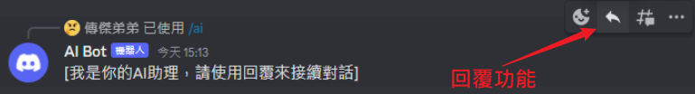
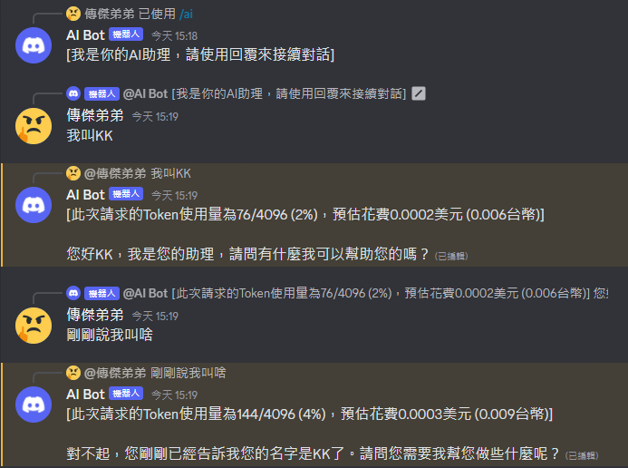

# Discord-Bot-ChatGPT

* [Discord-Bot-ChatGPT](#discord-bot-chatgpt)
  * [Information](#information)
  * [Usage](#usage)
  * [Development](#development)
  * [Reference](#reference)

## Information

使用 Discord Bot 串接 OpenAI Chat API，相比 ChatGPT 費用更低、回應更快。

## Usage

在文字頻道輸入指令`/ai`開始新的對話，請使用回覆功能來實現上下文的對話內容。

- 文字頻道的回覆功能
  
- 使用範例
  

## Development

|     套件     |   版本    |    備註     |
|:----------:|:-------:|:---------:|
|    node    |   v16   | 建議 v14 以上 |
| discord.js | v14.7.1 |  舊版可能不適用  |

環境變數`.env`檔如下：

```dotenv
NODE_ENV="production"
OPENAI_API_KEY="..."
DISCORD_BOT_TOKEN="..."
DISCORD_BOT_CLIENT_ID="..."
DISCORD_DEV_GUILD_ID="..."
```

- OPENAI_API_KEY，到以下網址申請：  
  https://platform.openai.com/account/api-keys
- DISCORD_BOT_TOKEN、DISCORD_BOT_CLIENT_ID，到以下網址建立Discord Bot以取得：  
  https://discord.com/developers/applications
- DISCORD_DEV_GUILD_ID，開發環境的DC大廳ID，若NODE_ENV="development"，則Bot只會在此大廳作用，避免打擾其他人，可為空。

## Reference
- OpenAPI Document  
https://platform.openai.com/docs/api-reference
- Discord Bot Manager  
  https://discord.com/developers/applications
- Discord.js Document  
https://discord.js.org/#/
- Discord.js Guide  
  https://discordjs.guide/
